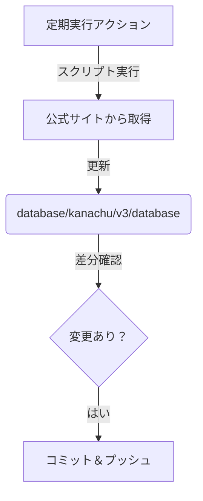
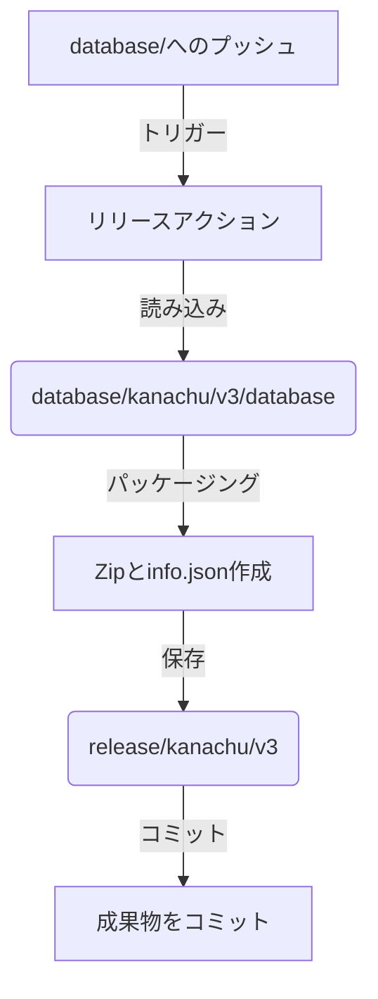

# 時刻表データベース for v3

## 概要

v3 データベースの仕様について記載する。

## ワークフロー

本データベースの構築からリリースまでの流れは、大きく「データベースの構築」と「リリース成果物の作成」の2つのフェーズに分かれています。

### 1. データベースの構築 (Database Construction)

神奈中バス公式サイトから最新情報を取得し、`database/` ディレクトリのマスターデータを更新するフェーズです。



- **トリガー**: 定期実行 (cron) または手動実行 (`Generate-v3` workflow)。
- **処理内容**:
    1. Pythonスクリプトを実行し、公式サイトから最新の時刻表データを取得します。
    2. 取得したデータを `database/kanachu/v3/database` 内の JSON ファイルとして保存します。
    3. 既存データと差分がある場合、変更をコミットしてリポジトリにプッシュします。

#### プリキャッシュによる負荷分散 (Pre-Caching for Load Balancing)

本番環境での一括取得による負荷を避けるため、日次で一部の路線を事前取得する仕組みを導入しています。

- **ワークフロー**: `Pre-Cache-v3`
- **頻度**: 毎日 (JST 00:00)
- **仕組み**:
    1. 全 1,500 路線を 7 分割し、曜日ごとに異なる 1/7（約 220 路線）を取得します。
    2. 取得したデータは GitHub Actions のキャッシュに保存されます。
    3. 本番の `Generate-v3` 実行時は、このキャッシュを再利用し、ETag による差分チェックを行うことで、実ダウンロードを最小限に抑えます。

### 2. リリース成果物の作成 (Release Artifact Creation)

更新されたデータベースを元に、アプリ開発者が利用しやすい形式（zip, info.json）を作成し、`release/` ディレクトリに配置するフェーズです。



- **トリガー**: `database/kanachu/v3/database` ディレクトリへの変更検知 (`Release-v3` workflow)。
- **処理内容**:
    1. `database/` 内のデータを読み込みます。
    2. 各路線のデータを個別の zip ファイルに圧縮します。
    3. 全体のメタデータと各ファイルのハッシュ値を含む `info.json` を生成します。
    4. 生成されたファイルを `release/kanachu/v3` ディレクトリに配置し、コミットします。

## ディレクトリ・ファイル構成

`v3` に関連するものだけを抽出。

```text
+ database/
  + kanachu/
    + v3/
      + database/
        + 0000800009/       : 路線ディレクトリ(フォルダ名は路線ID)
          + route.json      : 路線情報
          + 01.json         : 時刻表データ(ファイル名はインデックス)
          + ...
        + ...
        + busstops.json     : バス停一覧
        + route_ids.json    : 路線ID一覧
+ release/
  + kanachu/
    + v3/
      + database.zip        : database/kanachu/v3/database 以下を zip 圧縮。
      + info.json           : database/kanachu/v3/database のハッシュ値。
```

---
## 各ファイルについて

### リリース情報ファイル(info.json)

* リリース情報を `info.json` として配置。
* アプリからは、以下の URL で取得することを期待。
  * https://github.com/asabon/BusTimeTableDatabase/raw/main/release/kanachu/v3/info.json

* ファイルの中身は以下のようになっている。
    ```json
    {
      "updated_at": "2025-11-29",
      "hash": "e3b0c44298fc1c149afbf4c8996fb92427ae41e4649b934ca495991b7852b855",
      "busstops": {
        "hash": "a1b2c3d4e5f6..."
      },
      "routes": [
        {
          "id": "0000800009",
          "hash": "8d969eef6ecad3c29a3a629280e686cf0c3f5d5a86aff3ca12020c923adc6c92",
          "busstops": ["00128390", "00128389", "00128388", "00128357", "00128356"]
        },
        ...
      ]
    }
    ```
    * updated_at
      * データセット全体の最終更新日 (YYYY-MM-DD)
    * hash
      * データセット全体のハッシュ値 (SHA-256)
    * busstops
      * 全バス停マスタデータ (`busstops.json`) のメタデータ
      * `hash`: `busstops.json` のハッシュ値 (SHA-256)
    * routes
      * 路線ごとのメタデータリスト
      * `id`: 路線ID (ファイル名 `{route_id}.zip` に対応)
      * `hash`: その路線のデータのハッシュ値 (SHA-256)
      * `busstops`: その路線が経由するバス停IDのリスト (停車順)

### 路線別データ (`{route_id}.zip`)

* 特定の路線のみが必要なアプリ開発者向けに、路線ごとの個別zipファイルを提供します。
* 必要な路線だけをダウンロードすることで、通信量とストレージを節約できます。
* アプリからは、以下の URL で取得することを期待。
  * https://github.com/asabon/BusTimeTableDatabase/raw/main/release/kanachu/v3/{route_id}.zip

* すべてのzipファイルは、展開すると `database` というルートディレクトリの下に配置されるように構成されています。
* `busstops.json` はそのまま `database` ディレクトリ直下に配置してください。

### バス停一覧(busstops.json)

`busstops.json` として配置されている。

```json
{
    "busstops": [
        {
            "node_id": "00019206",
            "lat": "35.542788",
            "lng": "139.496985",
            "name": "中恩田橋",
            "position": "-"
        },
        //...
    ]
}
```

* node_id
  * バス停ID
* lat
  * 緯度
* lng
  * 経度
* name
  * バス停名称
* position
  * バス停の位置を表す補足情報
  * ウェブサイトから得られる情報と、そうでないものがある
  * そうでないものは、主観で設定している

### 路線ID一覧(route_ids.json)

`route_ids.json` として配置されている。
データベースに含まれる全ての路線IDのリスト。

```json
[
    "0000800009",
    "0000800012",
    //...
]
```

### 路線情報ファイル(route.json)

各路線ディレクトリ以下に、 `route.json` として配置されている。

```json
{
    "system": "厚74",
    "busstops": [
        {
            "index": "1",
            "id": "00128390",
            "name": "長坂(厚木市)",
            "lat": "35.523287",
            "lng": "139.351671"
        },
        //...
    ],
    "route_url": "https://www.kanachu.co.jp/dia/route/index/cid:0000800009/"
}
```

* system
  * 系統名
* busstops
  * 経由する順番に「バス停」の情報が並んでいる。
  * バス停情報
    * index: 順序 (1から始まる連番) -> `{index}.json` のファイル名に対応
    * id: バス停ID
    * name: バス停名
    * lat: このバス停の経度
    * lng: このバス停の緯度
* route_url
  * 神奈中公式サイトの路線ページURL

### 時刻表ファイル

各路線ディレクトリ内に、`数値(index).json` 形式のファイル名で配置されている。
ファイル名の数値は、`route.json` の `busstops` 内の `index` と対応している。

```json
{
    "date": "2020/11/16",
    "name": "長坂(厚木市)",
    "id": "00128390",
    "position": "-",
    "system": "厚74",
    "destinations": [
        "長坂下",
        "上依知中央",
        //...
    ],
    "weekday": [
        "6:35",
        "6:55"
    ],
    "saturday": [],
    "holiday": [],
    "url": "https://www.kanachu.co.jp/dia/diagram/timetable01_js/course:0000800009-1/node:00128390/kt:0/lname:/"
}
```

* date
  * ダイヤ改正日
* name
  * バス停名
* id
  * バス停ID
* position
  * 同じ名前のバス停が複数個所にある場合の位置を識別する情報
  * 神奈中データベースからは取得しておらず、手作業で管理している
  * 該当するデータがない場合は `-` を設定している
* system
  * 系統名
* destinations
  * 行き先（経由するバス停名）のリスト
* weekday, saturday, holiday
  * それぞれ「平日」「土曜」「休日」の時刻表データ
  * `H:MM` 形式の文字列として格納
* url
  * 神奈中公式サイトの時刻表ページURL
