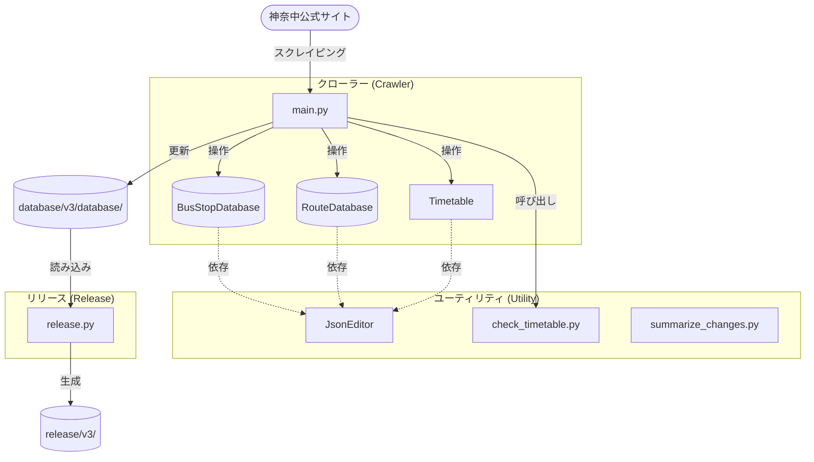

# script/v3 スクリプト群について

## 概要

`script/v3` フォルダ内のスクリプト群は、神奈中バス公式サイトから最新の時刻表・路線情報を取得し、データベースを更新・管理するためのものです。
主に「データ収集・更新（クローラー）」と「リリース成果物作成」の2つの役割に分かれています。

## 全体像・関係図



## スクリプト一覧

| ファイル名 | 役割 | 概要 |
| :--- | :--- | :--- |
| `main.py` | メイン処理 | 路線IDの収集や、指定路線のデータ取得・更新を統括するエントリーポイント。 |
| `busstop_database.py` | バス停マスタ管理 | `busstops.json` の読み書き、座標や名称の更新、位置補正情報の取得などを行う。 |
| `route_database.py` | 路線データ管理 | 路線ページを解析し、`route.json` （経由バス停、系統名など）を更新する。 |
| `timetable.py` | 時刻表データ管理 | 個別のバス停時刻表（`01.json`など）を取得・パースし、更新があれば保存する。 |
| `check_timetable.py` | バリデーション | `route.json` や時刻表 JSON のフォーマットが正しいかチェックする。 |
| `json_editor.py` | JSON操作ヘルパー | ドット繋ぎのパス（例: `busstops.0.name`）でJSONを操作するユーティリティクラス。 |
| `summarize_changes.py` | 差分サマリー出力 | Git の変更から更新された路線を特定し、Markdownテーブルで一覧出力する。 |
| `release.py` | 成果物作成 | `database/` 以下のデータを zip 圧縮し、リリース用の `info.json` を生成する。 |

---

## 各スクリプトの詳細

### 1. `main.py`
クローラーのメイン処理。
- **主な機能**:
    - `--update-list`: 路線IDの一覧（`route_ids.json`）をウェブサイトを巡回して更新する。不要になったディレクトリの削除も行う。
    - 通常実行: `offset`/`limit` または `total-parts`/`part_index` で範囲指定し、複数の路線データを並列または分割して取得する。
    - `--route-id <ID>`: 特定の路線IDのみを指定して取得する。
- **実行例**:
    ```bash
    # 路線一覧の更新
    python script/v3/main.py --update-list
    
    # 最初の10路線を処理
    python script/v3/main.py --limit 10
    ```

### 2. `busstop_database.py`
- **クラス**: `BusStopDatabase`
- **管理対象**: `busstops.json`
- **機能**:
    - バス停ID (`node_id`) をキーに、緯度・経度・名称・位置補正 (`position`) を管理。
    - 新しいバス停の追加時、`position` にはデフォルトで `"-"` を設定。

### 3. `route_database.py`
- **クラス**: `RouteDatabase`
- **管理対象**: 各路線ディレクトリの `route.json`
- **機能**:
    - 神奈中バスの路線ページURLから HTML を取得・パース。
    - 系統名（例: "厚74"）や、経由するバス停一覧（停車順）を抽出。
    - バス停クリック時の `onclick="move_center(...)"` から緯度経度を抽出。

### 4. `timetable.py`
- **クラス**: `Timetable`
- **管理対象**: `01.json` などの時刻表データ
- **機能**:
    - 時刻表ページ（HTML/JavaScript）をパースし、ダイヤ改正日や時刻表を抽出。
    - 前回のデータと「改正日」を比較し、更新がある場合のみ上書き保存する。

### 5. `check_timetable.py`
データ品質チェック用スクリプト。
- **機能**:
    - `validate_timetable(data)`: 時刻表データのフォーマット（日付の形式、名称、系統名など）を検証。
    - `validate_route(data)`: `route.json` のフォーマット（系統名、バス停、URL）を検証。
    - CLI モードで単独でのチェック（ファイル単体、またはディレクトリ再帰）が可能。

### 6. `summarize_changes.py`
GitHub Actionsなどで、更新内容をPRやIssueに通知するために使用される。
- **機能**:
    - `git status` を実行し、`database/v3/` 以下の変更ファイルをリストアップ。
    - 変更があった路線IDから `route.json` を逆引きし、系統や区間情報をまとめてMarkdown形式で一覧出力。

### 7. `release.py`
アプリ等に配信する最終データのパッケージングスクリプト。
- **機能**:
    - 各路線のフォルダを、再現性を保つ（ファイルのタイムスタンプ等を固定）形式で zip 圧縮。
    - リリースディレクトリ（`release/kanachu/v3`）に `busstops.json` をコピー。
    - 全体のハッシュ値、各 zip のハッシュ値を計算し、`info.json` を生成する。
    - `updated_at` はデータに変更（ハッシュの変化）がない場合は据え置く。
